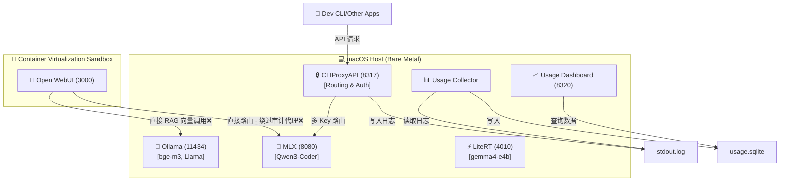
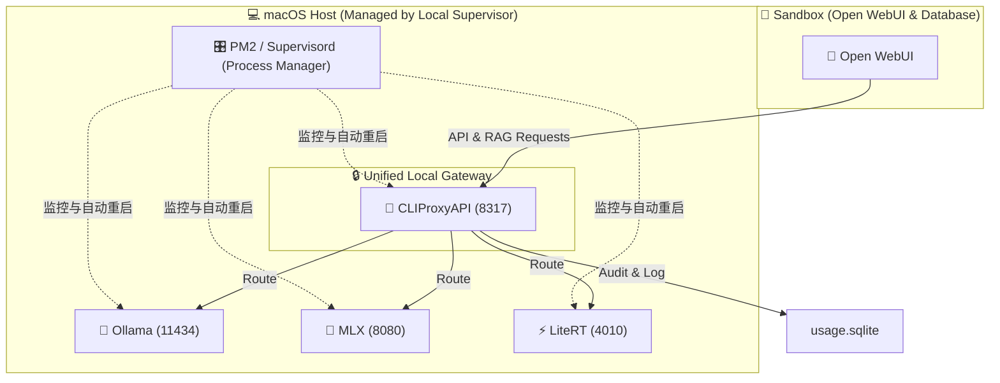

# 🏛️ Senior Architect's Review: Local AI Overall Architecture Evaluation

> [!NOTE]
> 作为资深架构师，在评估了您本地基于 Apple Silicon (M5) 的多引擎（Ollama, MLX, LiteRT）、隔离容器（Open WebUI）以及路由审计代理（CLIProxyAPI）的部署方案后，我为您整理了当前架构的**优势亮点**、**核心隐患（痛点）**以及**演进路线建议**。

---

## 🗺️ 当前架构拓扑图与审计路径漏失分析

当前物理层与虚拟容器层的拓扑关系如下：



> [!WARNING]
> **重大架构漏洞提醒**：
> 根据您笔记中 Open WebUI 的启动命令：
> `OPENAI_API_BASE_URL=http://192.168.64.1:8080/v1` 和 `OLLAMA_BASE_URL=http://192.168.64.1:11434`
> **您的 Open WebUI 是绕过 CLIProxyAPI (CPA) 代理直接调用后端引擎的！**
> 这意味着，通过 WebUI 产生的聊天对话和 RAG 流量**完全不会被 CPA 收集审计**，Usage Dashboard 里也就不会有这些聊天记录。CPA 目前只服务于您其他的命令行/外部应用请求。

---

## 🔍 当前架构的四大痛点评估

### 1. 📂 进程生命周期碎片化 (Lifecycle Fragmentation) —— 难维护、易失控
* **现状**：进程启动方式不一。Ollama 使用 `nohup`；MLX 和 LiteRT 使用 `screen`；CLIProxyAPI 纯手动拉起；Open WebUI 使用 `container` 命令。
* **弊端**：
  * 缺乏**统一的主动拉起与健康检查机制 (Supervisor)**。如果 MLX 异常退出，没有守护进程会去拉起它。
  * **僵尸进程风险**：`screen` 关掉后，底层 python 进程仍有可能悬空残留（正如 LiteRT 运维手册中记录的 `4010 already in use` 痛点）。

### 2. 🔌 物理网络网关硬编码 (Hardcoded Network IPs) —— 脆弱的物理依赖
* **现状**：Open WebUI 容器强绑定 `192.168.64.1`。
* **弊端**：
  * `bridge100` 的物理网关 IP 是由 macOS 底层虚拟化引擎动态分配的，虽然通常 is `.1`，但如果遇到网络重置、多虚拟机运行或网卡切换，IP 可能会发生变动，导致前端容器瞬间失联。
  * 这种物理耦合不符合“微服务容器化”的解耦原则。

### 3. 🛡️ 审计路径不统一 (Incomplete Audit Pipeline) —— 安全边界破裂
* **现状**：WebUI 直连引擎，只有外部 CLI 走 CPA。
* **弊端**：
  * 没有将代理中转服务（CPA）作为**统一的系统网关 (Unified Gateway)**。
  * 审计无法做到 100% 覆盖。

### 4. 🎛️ 配置管理离散 (Scattered Configuration) —— 代码与配置凌乱
* **现状**：
  * 启动脚本零散分布在各个目录下（`/Users/anan/.config/mlx/`，`/Users/anan/local_models/services/`）。
  * 配置文件零散在 `~/Library/Application Support/` 以及宿主机根目录下。
  * 没有统一的配置文件去管理每个引擎的端口、模型 ID 和环境变量。

---

## 🚀 架构改造演进路线 (Target Architecture)

为了保证后期易维护、脉络清晰，我们建议进行以下三大架构升级：

### 🎯 目标架构设计：统一网关 + 轻量级 Supervisor 编排



### 🛠️ 具体实施细节规划

#### 1. 引入轻量级进程守卫：PM2 或 Supervisord
* 弃用 `nohup` 和 `screen` 这类临时会话工具。
* 选用 **`PM2`** (前端友好，可用 npm 全局安装) 或 **`Supervisord`** 作为统一的守护进程管理器。
* 编写一份 `ecosystem.config.js`，一键管理所有 bare-metal 服务的生命周期 and 环境变量：
  ```javascript
  module.exports = {
    apps: [
      {
        name: 'ollama-backend',
        script: 'ollama',
        args: 'serve',
        env: { OLLAMA_HOST: '0.0.0.0', NO_PROXY: 'localhost,127.0.0.1,192.168.64.1' }
      },
      {
        name: 'mlx-qwen-coder',
        script: '/Users/anan/mlx_env/bin/python',
        args: '-m mlx_lm.server --model mlx-community/Qwen3-Coder-8B-Instruct-4bit --port 8080 --host 0.0.0.0'
      },
      {
        name: 'cliproxy-api',
        script: '/Users/anan/Library/Application Support/CLIProxyAPI/cli-proxy-api',
        args: '-config /Users/anan/Library/Application Support/CLIProxyAPI/config.yaml'
      }
    ]
  };
  ```
  * 这样只需运行 `pm2 start ecosystem.config.js` 即可拉起所有服务，`pm2 status` 查看所有服务，`pm2 monit` 查看 CPU/内存。

#### 2. 将 CLIProxyAPI 升级为统一系统网关 (Unified API Gateway)
* 修改 Open WebUI 容器启动的环境变量：
  * 将 `OPENAI_API_BASE_URL` 指向 **`http://192.168.64.1:8317/v1`** (CPA 代理端口) 而不是直连 MLX (8080)。
  * 在 CPA 配置文件中增加底层路由分发逻辑。
  * 效果：无论从 Web 界面聊天，还是命令行调用，所有流量经过统一网关审计，实现 100% 隐私审计覆盖。

#### 3. 配置归拢与物理路径标准化
* 将所有脚本、配置文件和启动描述，归拢在工作区的一个标准目录结构下（如 `/Users/anan/workspace/local-ai-core/`）：
  * `/config/`：存放 CPA 配置、Open WebUI 挂载卷。
  * `/scripts/`：存放运维自检脚本。
  * `/ecosystem/`：PM2 进程配置文件。
