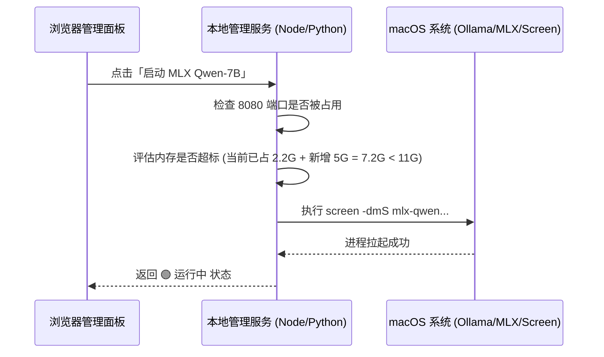

# 🎛️ 本地 AI 运维管理面板 (Local AI Manager Dashboard) 设计提案


为了解决本地模型服务（Ollama, MLX, LiteRT, CPA, Open WebUI）命令行繁多、内存占用难监控、运行状态不直观等痛点，我们建议为您构建一个**纯本地运行、极具现代科技感的 Web 可视化管理面板**。


---

## 🎨 视觉与体验设计 (Aesthetic Concept)
* **设计风格**：采用 **Apple Silicon 风格的暗黑玻璃拟态 (Glassmorphism)**，配合霓虹发光状态指示器。
* **状态配色**：
  * 🟢 **运行中 (Running)**：脉冲呼吸绿，高亮显示当前端口与 PID。
  * 🔴 **已停止 (Stopped)**：静默深灰，按钮显示“一键拉起”。
  * 🟡 **过渡中 (Loading)**：琥珀黄旋转加载，代表正在下载模型权重或加载至显存。
* **微动效**：卡片悬浮时的发光边框阴影、内存占用条的动态涨落动画。

---

## 🗺️ 界面布局概念 (UI Mockup)

```mermaid
%%{init: {'theme': 'dark', 'themeVariables': { 'background': '#121214'}}}%%
layout BT
graph TD
    subgraph UI["💻 Local AI Dashboard 仪表盘"]
        direction TB
        Header["👑 M5 Mac 16GB 控制中心 | 内存红线守卫: 🟢 安全 (已占用 4.8GB / 可用 10GB)"]
        
        subgraph EngineGrid["🛠️ 引擎状态与控制网格"]
            direction LR
            Card1["🦙 Ollama 服务 (11434) <br> [🟢 运行中] <br> 显存: ~2.2 GB (Llama-3.2-3B) <br> [ 停止 ] [ 更换模型 ▼ ]"]
            Card2["🚀 MLX 服务 (8080) <br> [🔴 已关停] <br> 显存: -- <br> [ 启动 ] [ 更换模型 ▼ ]"]
            Card3["⚡ LiteRT 服务 (4010) <br> [🔴 已关停] <br> 显存: -- <br> [ 启动 ]"]
        end

        subgraph ToolGrid["🔌 代理与前端套件"]
            direction LR
            Card4["🐳 Open WebUI 容器 (3000) <br> [🟢 运行中] <br> [ 停止 ] [ 进入网页 ↗ ]"]
            Card5["🔒 CLIProxyAPI 路由 (8317) <br> [🟢 运行中] <br> [ 停止 ] [ 查看Log ↗ ]"]
            Card6["📊 用量看板 (8320) <br> [🟢 运行中] <br> [ 停止 ] [ 查看看板 ↗ ]"]
        end
        
        subgraph Utility["🏥 运维工具箱"]
            direction LR
            Util1["🌐 网络诊断: bridge100 (192.168.64.1) [🟢 通畅]"]
            Util2["🔥 内存一键释放 (Mac 退烧药)"]
        end
        
        Header --> EngineGrid
        EngineGrid --> ToolGrid
        ToolGrid --> Utility
    end
```

---

## 🌟 核心特色功能拓展

### 1. 🚨 内存红线守护 (Memory Safeguard)
* **痛点**：M5 16GB 内存空间有限，如果同时运行 Ollama Gemma-4-12B (6.9GB) 和 MLX Qwen3-Coder-14B (8.8GB)，内存占用将达到 15.7GB，直接触发硬盘 Swap 导致 Mac 死机。
* **机制**：面板会实时计算当前所有“运行中”服务的**预估显存总和**。当用户尝试启动一个新模型导致总占用超过 11GB 临界值时，面板弹出**红色警告**，禁止直接拉起，并提示用户“需要先关闭哪些模型服务”。

### 2. ⚡ Mac 一键“退烧药” (Cool Down Button)
* **功能**：设计一个醒目的红色按钮。点击后一键执行：
  ```bash
  container stop local-webui && kill $(pgrep -f mlx_lm) && killall ollama
  ```
  瞬间释放所有 CPU/GPU 资源，关闭虚拟机，让 Mac 温度秒降。

### 3. 🔍 实时日志流查看器 (Live Log Terminal)
* **功能**：无需在终端里敲 `tail -f`。每个服务卡片提供一个“查看日志”图标，点击后以**折叠抽屉或浮层**形式展现，通过 WebSocket 实时读取日志文件（如 `/tmp/ollama.log` 或 `stdout.log`），过滤出 Error 并高亮。

### 4. 🔗 桥接网卡健康度诊断
* **功能**：自动检查 `bridge100` 网卡是否已分配 `192.168.64.1`。
* **代理预警**：检测系统是否开启了 Clash 等 TUN 模式代理，如果发现 `host.docker.internal` 被解析为 Fake-IP，在网页顶部给出黄色 Banner 提醒，并指导用户开启直连。

---

## 🛠️ 技术实现架构建议

我们建议使用 **Vite + React/Vue3 (前端) + Fastify/Express (轻量级 Node/Python 后端)** 来极速开发这个工具：



### 本地执行命令对接层示例 (Node.js 后端)：
```javascript
import { exec } from 'child_process';

// 检查 Ollama 状态
export function checkOllamaStatus() {
  return new Promise((resolve) => {
    exec('lsof -i :11434', (err, stdout) => {
      resolve(stdout.includes('LISTEN'));
    });
  });
}

// 一键启动 Ollama
export function startOllama() {
  const cmd = `export OLLAMA_HOST=0.0.0.0; export NO_PROXY=localhost,127.0.0.1,192.168.64.1; nohup ollama serve >/tmp/ollama.log 2>&1 &`;
  exec(cmd);
}
```
